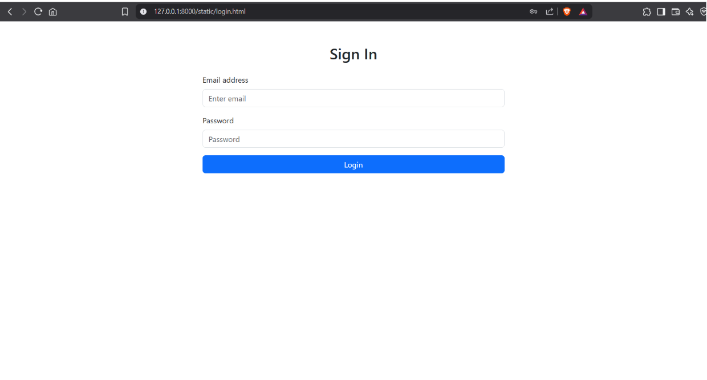
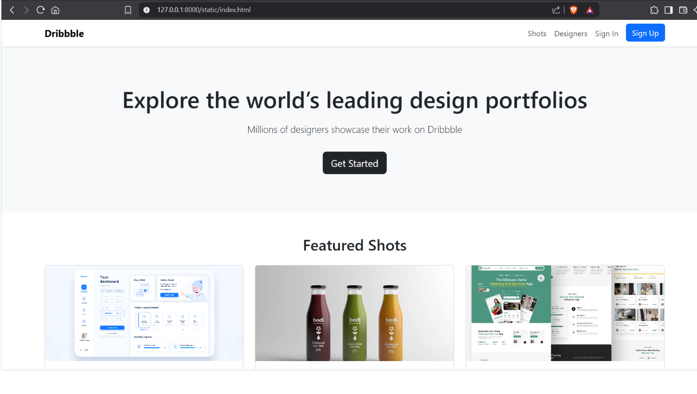

# Project Responsive Web Design using Bootstrap
## Date:29.5.25

## AIM:
To create a simplified clone of Dribbble (https://dribbble.com/) landing page.


## DESIGN STEPS:

### Step 1:
Clone the repository from GitHub.

### Step 2:
Create Django Admin project.

### Step 3:
Create a New App under the Django Admin project.

### Step 4:
Insert the necessary CSS and JavaScript files as external in order to use Bootstrap.

### Step 5:
Create a HTML file and include the needed Bootstrap components.

### Step 6:
Publish the website in the LocalHost.

## PROGRAM :
```
login.html

<!DOCTYPE html>
<html lang="en">
<head>
  <meta charset="UTF-8">
  <meta name="viewport" content="width=device-width, initial-scale=1">
  <title>Login - Dribbble Clone</title>
  <link href="https://cdn.jsdelivr.net/npm/bootstrap@5.3.0/dist/css/bootstrap.min.css" rel="stylesheet">
</head>
<body>
  <div class="container py-5">
    <h2 class="text-center mb-4">Sign In</h2>
    <div class="row justify-content-center">
      <div class="col-md-6">
        <form>
          <div class="mb-3">
            <label for="email" class="form-label">Email address</label>
            <input type="email" class="form-control" id="email" placeholder="Enter email">
          </div>
          <div class="mb-3">
            <label for="password" class="form-label">Password</label>
            <input type="password" class="form-control" id="password" placeholder="Password">
          </div>
          <button type="submit" class="btn btn-primary w-100">Login</button>
        </form>
      </div>
    </div>
  </div>
</body>
</html>


index.html


<!DOCTYPE html>
<html lang="en">
<head>
  <meta charset="UTF-8">
  <meta name="viewport" content="width=device-width, initial-scale=1">
  <title>Dribbble Clone</title>
  <link href="https://cdn.jsdelivr.net/npm/bootstrap@5.3.0/dist/css/bootstrap.min.css" rel="stylesheet">
  <style>
    body {
      font-family: 'Segoe UI', sans-serif;
    }
    .hero {
      background-color: #f8f9fa;
      padding: 80px 0;
      text-align: center;
    }
    .hero h1 {
      font-size: 3rem;
      margin-bottom: 20px;
    }
    .card img {
      height: 200px;
      object-fit: cover;
    }
    .navbar-brand {
      font-weight: bold;
    }
  </style>
</head>
<body>

<!-- Navbar -->
<nav class="navbar navbar-expand-lg navbar-light bg-white shadow-sm">
  <div class="container">
    <a class="navbar-brand" href="#">Dribbble</a>
    <button class="navbar-toggler" type="button" data-bs-toggle="collapse" data-bs-target="#navmenu">
      <span class="navbar-toggler-icon"></span>
    </button>
    <div class="collapse navbar-collapse" id="navmenu">
      <ul class="navbar-nav ms-auto">
        <li class="nav-item"><a class="nav-link" href="#">Shots</a></li>
        <li class="nav-item"><a class="nav-link" href="#">Designers</a></li>
        <li class="nav-item"><a class="nav-link" href="./login.html">Sign In</a></li>
        <li class="nav-item"><a class="btn btn-primary ms-2" href="./login.html">Sign Up</a></li>
      </ul>
    </div>
  </div>
</nav>

<!-- Hero Section -->
<section class="hero">
  <div class="container">
    <h1>Explore the world’s leading design portfolios</h1>
    <p class="lead">Millions of designers showcase their work on Dribbble</p>
    <a href="./login.html" class="btn btn-dark btn-lg mt-3">Get Started</a>

  </div>
</section>

<!-- Cards Section -->
<section class="py-5">
  <div class="container">
    <h2 class="mb-4 text-center">Featured Shots</h2>
    <div class="row g-4">
      <div class="col-md-4">
        <div class="card">
          
          <div class="card-body">
            <h5 class="card-title">Creative UI</h5>
            <p class="card-text">A sleek modern interface concept for a dashboard app.</p>
          </div>
        </div>
      </div>
      <div class="col-md-4">
        <div class="card">
          
          <div class="card-body">
            <h5 class="card-title">Brand Identity</h5>
            <p class="card-text">Fresh brand design concept for a startup company.</p>
          </div>
        </div>
      </div>
      <div class="col-md-4">
        <div class="card">
          
          <div class="card-body">
            <h5 class="card-title">Landing Page</h5>
            <p class="card-text">Clean and responsive web landing page layout.</p>
          </div>
        </div>
      </div>
    </div>
  </div>
</section>

<!-- Footer -->
<footer class="bg-dark text-white text-center py-4">
  <p class="mb-0">&copy; 2025 Dribbble Clone. All rights reserved.</p>
</footer>

<script src="https://cdn.jsdelivr.net/npm/bootstrap@5.3.0/dist/js/bootstrap.bundle.min.js"></script>
</body>
</html>


```

## OUTPUT:







## RESULT:
The Project for responsive web design using Bootstrap is completed successfully.
